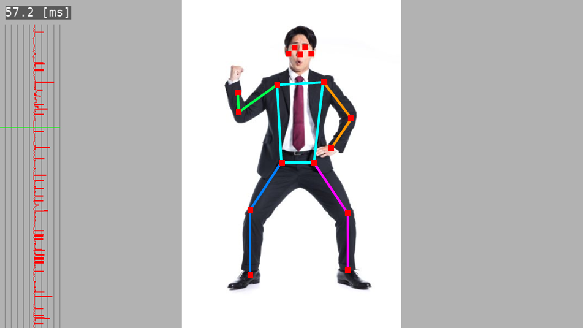

# GPU Accelerated TensorFlow Lite applications on Android NDK.
Run and measure the performance of TensorFlow Lite GPU Delegate on Android NDK.


## applications
| App name    | Descriptions |
|:-----------:|:------------:|
| [tflite_posenet](https://github.com/terryky/android_tflite/tree/master/tflite_posenet)|  <br> Pose Estimation.|
| [tflite_style_transfer](https://github.com/terryky/android_tflite/tree/master/tflite_style_transfer)|  <br> Artistic style transfer.|


## How to Build & Run

### (step-1) Build TensorFlow Lite library and GPU Delegate library.
- Download and install [Android NDK](https://developer.android.com/ndk/downloads).
- Download and install [bazel](https://docs.bazel.build/versions/master/install-ubuntu.html).
- Run a build script as bellow.
  This script launch the ```./configure``` command, so press enter-key several times to select the default config.


```
$ cd android_tflite/third_party/
$ ./build_libtflite_r2.2_android.sh
```

Then, you will get TensorFlow Lite library and GPU Delegate library as follows.

```
$ ls -l tensorflow/bazel-bin/tensorflow/lite/
-r-xr-xr-x  1 terryky terryky  2610368  3ŒŽ 20 13:42 libtensorflowlite.so*

$ ls -l tensorflow/bazel-bin/tensorflow/lite/delegates/gpu/
-r-xr-xr-x 1 terryky terryky  59657040  3ŒŽ 20 13:43 libtensorflowlite_gpu_delegate.so*
```


### (step-2) Build Android Applications
- Download and install [Android Studio](https://developer.android.com/studio/install).
- Start Android Studio.
- Open application folder (eg. ```tflite_posenet```).
- Build and Run.

## Tested Environment

| Host PC             | Target Device           |
|:-------------------:|:-----------------------:|
| x86_64              | arm64-v8a               |
| Ubuntu 18.04.4 LTS  | Android 9 (API Level 28)|
| Android NDK r20b    |                         |
